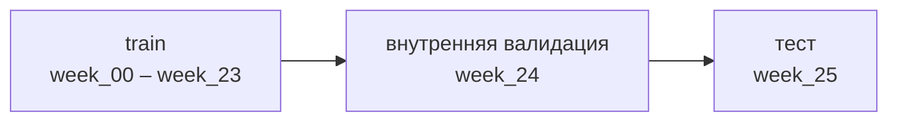

# VK-LSVD: описание датасета и план сабсетов

## Обзор датасета

Для курсовой берём VK-LSVD и работаем только на готовых сабсетах: весь датасет весит 452 ГБ и локально не нужен.

VK-LSVD — открытый индустриальный датасет коротких видео VK: 10 млн пользователей, 19,6 млн видео, 40,8 млрд уникальных взаимодействий за 6 месяцев, плотность 0,0208%. У каждого показа есть неявная обратная связь (время просмотра) и явная (лайк, дизлайк, шер, закладка, переход к автору, открытие комментариев). Повторных показов одной пары пользователь–видео нет.

Лицензия Apache-2.0. Статья принята на WWW 2026; авторы позиционируют датасет под последовательные рекомендации и холодный старт.

- [Карточка датасета на Hugging Face](https://huggingface.co/datasets/deepvk/VK-LSVD)
- [Статья: VK-LSVD, arXiv 2602.04567](https://arxiv.org/abs/2602.04567)

## Структура данных

Датасет — это недельные parquet-файлы взаимодействий плюс три общих файла метаданных. Все категориальные поля анонимизированы в стабильные целые ID, одинаковые во всех сабсетах и сплитах.

| Файл | Что внутри | Ключевые поля |
| --- | --- | --- |
| `subsamples/<сабсет>/train/week_00…week_24.parquet` | Взаимодействия, 25 недель обучения | `user_id`, `item_id`, `place`, `platform`, `agent`, `timespent` (0–255 с), 6 булевых флагов фидбэка |
| `subsamples/<сабсет>/validation/week_25.parquet` | Взаимодействия, неделя валидации | те же |
| `metadata/users_metadata.parquet` | Пользователи | `age` (18–70), `gender`, `geo` (80 ID), `train_interactions_rank` |
| `metadata/items_metadata.parquet` | Видео | `author_id`, `duration` (с), `train_interactions_rank` |
| `metadata/item_embeddings.npz` | Контентные эмбеддинги | `item_id`, `embedding` float16\[64\] |

Внутри каждого недельного файла строки идут по возрастанию времени. `train_interactions_rank` — ранг популярности (меньше = больше взаимодействий), по нему нарезаны сабсеты.

**Эмбеддинги — главное для темы курсовой.** Они обучены только на контенте (видео, описание, аудио), без коллаборативного сигнала. Компоненты упорядочены: скалярное произведение первых n компонент приближает косинус исходных продакшн-эмбеддингов. Значит, размерность можно брать любую от 1 до 64 без переобучения — это прямо даёт эксперимент «качество против размерности».

## Выбранные сабсеты

Плотный сабсет фиксирован — `up0.001_ip0.001`. Для разреженного режима держим два варианта: выбор зависит от того, войдут ли в курсовую холодный старт и разрез по популярности видео.

| Сабсет | Роль | Как отобран | Пользователи | Айтемы | Взаимодействия | Плотность | Память, ≈ |
| --- | --- | --- | --- | --- | --- | --- | --- |
| `up0.001_ip0.001` | Плотный | топ-0,1% активных пользователей × топ-0,1% популярных видео | 10 000 | 19 628 | 47 976 280 | 24,44% | 0,6 ГБ |
| `ur0.01_ip0.01` | Разреженный, вариант A | 1% случайных пользователей × топ-1% популярных видео | 99 893 | 196 277 | 191 625 941 | 0,98% | 2,4 ГБ |
| `ur0.01_ir0.01` | Разреженный, вариант B | 1% случайных пользователей × 1% случайных видео | 90 178 | 125 018 | 4 044 900 | 0,036% | 0,05 ГБ |
| `whole` | Справочно | весь датасет | 10 000 000 | 19 627 601 | 40 774 024 903 | 0,0208% | не качаем |

Память — оценка сырой таблицы взаимодействий в Polars по типам колонок (около 13 байт на строку), без обучения модели.

### Варианты разреженного сабсета

Вариант A проще для обучения и сравним с плотным по составу айтемов; вариант B ближе к реальным данным и открывает вопросы про хвост и холодный старт.

|  | Вариант A: `ur0.01_ip0.01` | Вариант B: `ur0.01_ir0.01` |
| --- | --- | --- |
| Какие видео | только топ-1% популярных | случайный 1%, есть хвост |
| Размер | 192 млн строк, ≈ 2,4 ГБ | 4 млн строк, ≈ 0,05 ГБ |
| Плотность против полного датасета (0,0208%) | в 47 раз плотнее | почти как полный |
| Отличие от плотного сабсета | только плотность: айтемы тоже популярные | и плотность, и состав айтемов |
| Какие вопросы закрывает | качество против размерности эмбеддингов; точность против разнообразия | то же + холодные и хвостовые видео, разрез по популярности |
| Риски | холодного старта и хвоста нет; тяжёлый для ноутбука, скорее всего брать последние 4–8 недель | у многих пользователей мало взаимодействий: нужен фильтр по минимуму взаимодействий; метрики шумнее |

Как решить: если в исследовательских вопросах есть холодный старт или хвост — берём B, иначе A. Вариант B весит 50 МБ, поэтому его можно прогонять в любом случае как третий режим плотности.

[Источник статистик: карточка датасета](https://huggingface.co/datasets/deepvk/VK-LSVD)

## Протокол сплита

Сплит уже глобальный временной (GTS): обучаемся на прошлом, проверяем на будущем, утечки по времени нет.



Предложение: официальную неделю `validation` (week\_25) используем как тест, а для подбора гиперпараметров и early stopping отрезаем последнюю неделю train (week\_24). Так валидация и тест устроены одинаково, а тест ни разу не видит тюнинг.

Оценка: NDCG@K, Recall@K по полному каталогу сабсета (без сэмплирования негативов), плюс coverage и разнообразие. Что считать позитивом — открытый вопрос, см. последний раздел.

## Скачивание и хранение локально

Качаем только папки выбранных сабсетов и метаданные, читаем лениво через Polars, эмбеддинги один раз фильтруем под сабсет и сохраняем отдельно.

1. Скачать нужное одной командой (повторный запуск докачивает, а не качает заново):

```python
from huggingface_hub import snapshot_download

SUBSETS = [
    "up0.001_ip0.001",  # плотный
    "ur0.01_ip0.01",    # разреженный, вариант A
    "ur0.01_ir0.01",    # разреженный, вариант B (50 МБ, можно качать всегда)
]

snapshot_download(
    repo_id="deepvk/VK-LSVD",
    repo_type="dataset",
    local_dir="data/raw/VK-LSVD",
    allow_patterns=[f"subsamples/{s}/*" for s in SUBSETS] + ["metadata/*"],
)
```

2. Читать лениво и только нужные колонки и недели:

```python
import polars as pl

def load_weeks(subset: str, split: str, weeks: range, cols: list[str]) -> pl.DataFrame:
    root = f"data/raw/VK-LSVD/subsamples/{subset}/{split}"
    lf = pl.concat([pl.scan_parquet(f"{root}/week_{w:02}.parquet") for w in weeks])
    return lf.select(cols).collect(engine="streaming")

train = load_weeks("ur0.01_ip0.01", "train", range(17, 24),
                   ["user_id", "item_id", "timespent", "like"])
```

3. Эмбеддинги: полный `item_embeddings.npz` — это около 2,5 ГБ (19,6 млн × 64 × float16), `np.load` поднимает его в память целиком. Делаем это один раз на сабсет и сохраняем срез:

```python
from pathlib import Path
import numpy as np
import polars as pl

subset = "ur0.01_ip0.01"
root = f"data/raw/VK-LSVD/subsamples/{subset}"

subset_items = (
    pl.scan_parquet(f"{root}/*/week_*.parquet")
    .select("item_id").unique()
    .collect(engine="streaming")["item_id"].to_numpy()
)

z = np.load("data/raw/VK-LSVD/metadata/item_embeddings.npz")
ids, emb = z["item_id"], z["embedding"]
mask = np.isin(ids, subset_items)

out = Path(f"data/processed/{subset}")
out.mkdir(parents=True, exist_ok=True)
np.save(out / "item_ids.npy", ids[mask])
np.save(out / "item_emb64.npy", emb[mask])
```

Дальше обрезка до n компонент — просто `emb[:, :n]`, без повторной загрузки. Для `ur0.01_ip0.01` срез весит около 25 МБ.

Структура папок:

```
data/
  raw/VK-LSVD/          # как скачано с HF, не трогаем
  processed/<сабсет>/   # эмбеддинги-срезы, id-маппинги, признаки
experiments/            # конфиги и метрики прогонов
```

`data/` — в `.gitignore`; в репозиторий идёт только скрипт скачивания.

[Источник: Quick Start в карточке датасета](https://huggingface.co/datasets/deepvk/VK-LSVD)

## Открытые вопросы

- [ ] Разреженный сабсет: вариант A или B — решить после формулировки исследовательских вопросов (будут ли холодный старт и хвост).
- [ ] Что считать позитивом: любой показ, `timespent` выше порога (какого?), лайк или комбинацию сигналов?
- [ ] Есть ли в репозитории отдельный публичный test или week\_25 — последняя доступная неделя?
- [ ] Сколько недель train брать для варианта A: все 24 или последние 4–8?
- [ ] Какое железо доступно для обучения: ноутбук, сервер кафедры, Colab/Kaggle?

## Источники

- [VK-LSVD — карточка датасета, Hugging Face](https://huggingface.co/datasets/deepvk/VK-LSVD)
- [Poslavsky et al., VK-LSVD: A Large-Scale Industrial Dataset for Short-Video Recommendation, WWW 2026](https://arxiv.org/abs/2602.04567)
- [Gusak et al., Time to Split: Exploring Data Splitting Strategies for Offline Evaluation of Sequential Recommenders, RecSys 2025](https://arxiv.org/abs/2507.16289)
